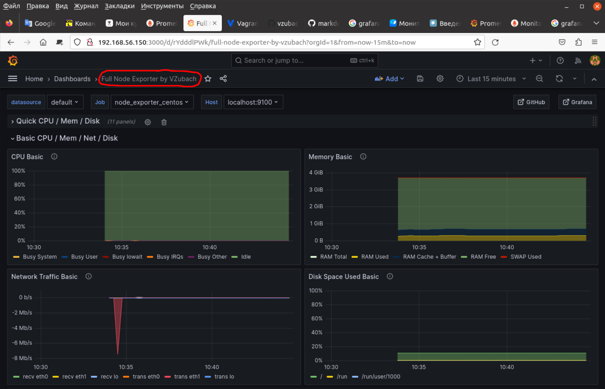

### OTUS-Linux-2023-04-L21 | Monitoring | Prometheus ###

На скрине ниже дашбор из Grafana. Данные собираются с ВМ с помощью Node_Exporter'а, передаются в Prometheus, который используется в Grafana как источник метрик.  

